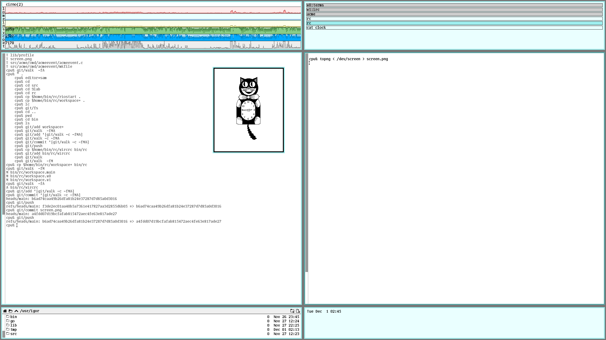
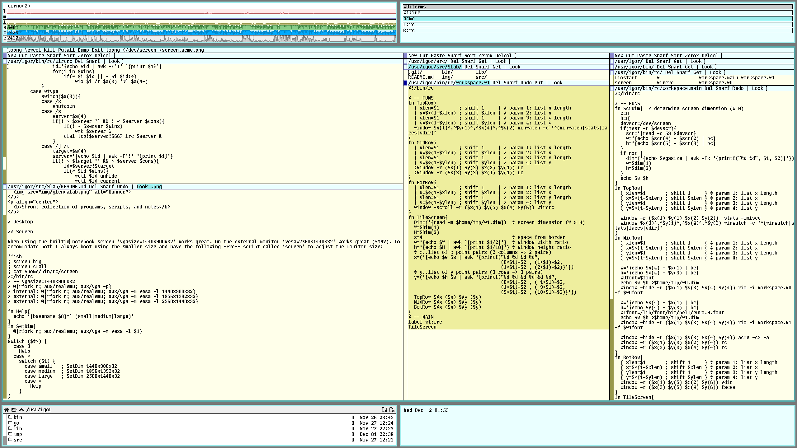
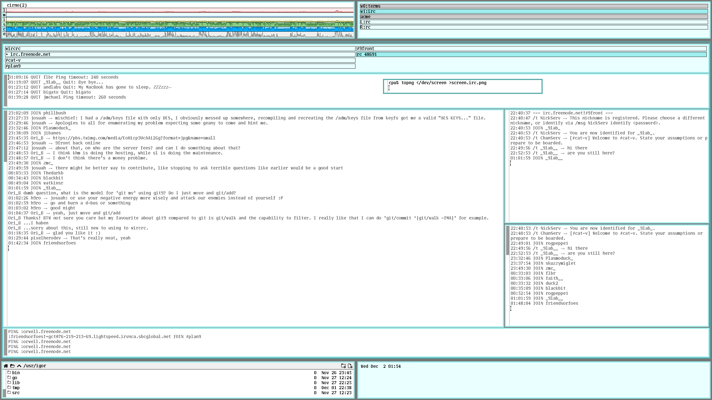
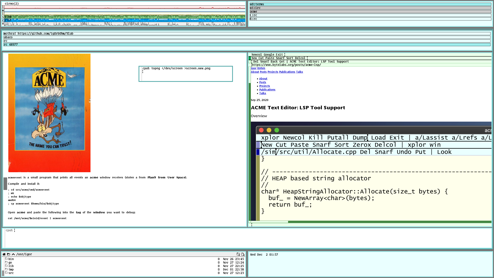

<p align="center">
  
</p>
<p align="center">
  <b>9Front collection of programs, scripts, and notes</b>
</p>

# Desktop

## Screen

When using the builtin notebook screen `vgasize=1440x900x32` works great. On the external monitor `vesa=2560x1440x32` works great (YMMV). To accommodate both I always boot using the smaller size and have the following **rc** script called `screen` to adjust the monitor size:

```sh
; screen big
; screen small
; cat $home/bin/rc/screen
#!/bin/rc
# -- vgasize=1440x900x32
# @{rfork n; aux/realemu; aux/vga -p}
# internal: @{rfork n; aux/realemu; aux/vga -m vesa -l 1440x900x32}
# external: @{rfork n; aux/realemu; aux/vga -m vesa -l 1856x1392x32}
# external: @{rfork n; aux/realemu; aux/vga -m vesa -l 2560x1440x32}

fn Help{
  echo `{basename $0}^' (small|medium|large)'
}
fn SetDim{
  @{rfork n; aux/realemu; aux/vga -m vesa -l $1}
}
switch ($#*) {
  case 0
    Help
  case *
    switch ($1) {
      case small   ; SetDim 1440x900x32
      case medium  ; SetDim 1856x1392x32
      case large   ; SetDim 2560x1440x32
      case *
        Help
    }
}
```

## Workspaces

**rio** is configured in a 2-column by 3-rows layout. The top row displays `stats` and `winwatch`. The bottom row has `vdir` and `faces` (don't have mail setup yet in 9front).

The middle row houses applications in the `main` workspace such as windows with `rc` and `acme` as well as two `virtual` desktops.

The following sketches out how this is configured (this is still WIP):

```sh
; cat $home/bin/rc/riostart
#!/bin/rc
window workspace.main
```

`workspace.main` takes care of figuring out the screen size and determining key coordinates to place windows the way I like them:

```sh
; cat $home/bin/rc/workspace.main
#!/bin/rc
# -- FUNS
fn ScrDim{  # determine screen dimension (W H)
  w=0
  h=0
  devscr=/dev/screen
  if(test -r $devscr){
    scr=`{read -c 59 $devscr}
    w=`{echo $scr(4) - $scr(2) | bc}
    h=`{echo $scr(5) - $scr(3) | bc}  
  }
  if not {
    dim=(`{echo $vgasize | awk -Fx '{printf("%d %d", $1, $2)}'})
    w=$dim(1)
    h=$dim(2)  
  }
  echo $w $h
}
fn TopRow{
  { xlen=$1       ; shift 1     } # param 1: list x length
  { x=$*(1-$xlen) ; shift $xlen } # param 2: list x
  { ylen=$1       ; shift 1     } # param 3: list y length
  { y=$*(1-$ylen) ; shift $ylen } # param 4: list y

  window -r ($x(1) $y(1) $x(2) $y(2))  stats -lmisce
  window $x(3)^,^$y(1)^,^$x(4)^,^$y(2) winwatch -e '^(winwatch|stats|faces|vdir)'
}
fn MidRow{
  { xlen=$1       ; shift 1     } # param 1: list x length
  { x=$*(1-$xlen) ; shift $xlen } # param 2: list x
  { ylen=$1       ; shift 1     } # param 3: list y length
  { y=$*(1-$ylen) ; shift $ylen } # param 4: list y
    
  w=`{echo $x(4) - $x(1) | bc}
  h=`{echo $y(4) - $y(3) | bc}
  w0font=$font
  echo $w $h >$home/tmp/w0.dim
  window -hide -r ($x(1) $y(3) $x(4) $y(4)) rio -i workspace.w0 -f $w0font

  w=`{echo $x(4) - $x(1) | bc}
  h=`{echo $y(4) - $y(3) | bc}
  w1font=/lib/font/bit/pelm/euro.9.font
  echo $w $h >$home/tmp/w1.dim
  window -hide -r ($x(1) $y(3) $x(4) $y(4)) rio -i workspace.w1 -f $w1font

  window -hide -r ($x(1) $y(3) $x(4) $y(4)) acme -c3 -a
  window -r ($x(1) $y(3) $x(2) $y(4)) rc
  window -r ($x(3) $y(3) $x(4) $y(4)) rc
}
fn BotRow{
  { xlen=$1       ; shift 1     } # param 1: list x length
  { x=$*(1-$xlen) ; shift $xlen } # param 2: list x
  { ylen=$1       ; shift 1     } # param 3: list y length
  { y=$*(1-$ylen) ; shift $ylen } # param 4: list y
  window -r ($x(1) $y(5) $x(2) $y(6)) vdir
  window -r ($x(3) $y(5) $x(4) $y(6)) faces
}
fn TileScreen{
  Dim=(`{ScrDim})                    # screen dimension (W x H)
  W=$Dim(1)
  H=$Dim(2)
  s=5                                # space from border
  w=`{echo $W | awk '{print $1/2}'}  # window width ratio
  h=`{echo $H | awk '{print $1/10}'} # window height ratio
  # x..list of x point pairs (2 columns -> 2 pairs)
  x=(`{echo $w $s | awk '{printf("%d %d %d %d",
                                 (0*$1)+$2 , (1*$1)-$2,
                                 (1*$1)+$2 , (2*$1)-$2)}'})
  # y..list of y point pairs (3 rows -> 3 pairs)
  y=(`{echo $h $s | awk '{printf("%d %d %d %d %d %d",
                                 (0*$1)+$2 , ( 1*$1)-$2,
                                 (1*$1)+$2 , ( 9*$1)-$2,
                                 (9*$1)+$2 , (10*$1)-$2)}'})
  TopRow $#x ($x) $#y ($y)
  MidRow $#x ($x) $#y ($y)
  BotRow $#x ($x) $#y ($y)
}
# -- MAIN
>$home/tmp/w0.dim
>$home/tmp/w1.dim
TileScreen
```

You can see that two other workspaces are created, here is what one looks like to give an idea:

```sh
; cat $home/bin/rc/workspace.w1
#!/bin/rc
# -- FUNS
fn TopRow{
  { xlen=$1       ; shift 1     } # param 1: list x length
  { x=$*(1-$xlen) ; shift $xlen } # param 2: list x
  { ylen=$1       ; shift 1     } # param 3: list y length
  { y=$*(1-$ylen) ; shift $ylen } # param 4: list y
  window $x(1)^,^$y(1)^,^$x(4)^,^$y(2) winwatch -e '^(winwatch|stats|faces|vdir)'
}
fn MidRow{
  { xlen=$1       ; shift 1     } # param 1: list x length
  { x=$*(1-$xlen) ; shift $xlen } # param 2: list x
  { ylen=$1       ; shift 1     } # param 3: list y length
  { y=$*(1-$ylen) ; shift $ylen } # param 4: list y
  #window -r ($x(1) $y(3) $x(2) $y(4)) rc
  #window -r ($x(3) $y(3) $x(4) $y(4)) rc
}
fn BotRow{
  { xlen=$1       ; shift 1     } # param 1: list x length
  { x=$*(1-$xlen) ; shift $xlen } # param 2: list x
  { ylen=$1       ; shift 1     } # param 3: list y length
  { y=$*(1-$ylen) ; shift $ylen } # param 4: list y
  window -scroll -r ($x(1) $y(5) $x(4) $y(6)) wircrc
}
fn TileScreen{
  Dim=(`{read -m $home/tmp/w1.dim})  # screen dimension (W x H)
  W=$Dim(1)
  H=$Dim(2)
  s=4                                # space from border
  w=`{echo $W | awk '{print $1/2}'}  # window width ratio
  h=`{echo $H | awk '{print $1/10}'} # window height ratio
  # x..list of x point pairs (2 columns -> 2 pairs)
  x=(`{echo $w $s | awk '{printf("%d %d %d %d",
                                 (0*$1)+$2 , (1*$1)-$2,
                                 (1*$1)+$2 , (2*$1)-$2)}'})
  # y..list of y point pairs (3 rows -> 3 pairs)
  y=(`{echo $h $s | awk '{printf("%d %d %d %d %d %d",
                                 (0*$1)+$2 , ( 1*$1)-$2,
                                 (1*$1)+$2 , ( 9*$1)-$2,
                                 (9*$1)+$2 , (10*$1)-$2)}'})
  TopRow $#x ($x) $#y ($y)
  MidRow $#x ($x) $#y ($y)
  BotRow $#x ($x) $#y ($y)
}
# -- MAIN
label w1:irc
TileScreen

```

Here is what the **main** workspace looks like:

<p align="center">
  
</p>

**main** workspace with **acme** in front:
 
<p align="center">
  
</p>
 
On this screenshot you can see the a virtual desktop with **wircrc** running:

<p align="center">
  
</p>

And finally, this is what the web looks like :-P :

<p align="center">
  
</p>


# Acme

<p align="center">
  
</p>

`acmeevent` is a small program that prints all events an **acme** window receives (stolen a from **Plan9 from User Space**).

Compile and install it:

```sh
; cd src/acme/cmd/acmeevent
; mk
; echo $objtype
amd64
; cp acmeevent $home/bin/$objtype
```

Open **acme** and paste the following into the **tag** of the **window** you want to debug:

```sh
cat /mnt/acme/$winid/event | acmeevent
```

Then you should see all events that are received by the **window** (see **event** in acme(4)).

# Go

To install Go one has to bootstrap the installation with an earlier version of Go already compiled for Plan 9. The process consists of obtaining the bootstap version and the target version, followed by telling the target version to use the bootstrapped version in order to build the toolchain.

Temporary scratch space:
```sh
term% ramfs
term% cd /tmp
```

Download **bootstrap** and **target** versions of **go**:
```sh
term% hget http://www.9legacy.org/download/go/go1.14.1-plan9-amd64-bootstrap.tbz | bunzip2  -c | tar x 
term% hget https://golang.org/dl/go1.14.7.src.tar.gz | gunzip -c | tar x
```

Create **target** installation directory and **bind** downloaded version to that directory:
```sh
term% mkdir -p /sys/lib/go/amd64-1.14.7
term% bind -c go /sys/lib/go/amd64-1.14.7 
```

Setup `GOROOT_BOOTSTRAP`:
```sh
term% cd /sys/lib/go/amd64-1.14.7/src 
term% GOROOT_BOOTSTRAP=/tmp/go-plan9-amd64-bootstrap
```

To pass standard library tests configure loopback address:
```sh
term% ip/ipconfig -P loopback /dev/null 127.1 
term% ip/ipconfig -P loopback /dev/null ::1
```

Start the install:
```sh
term% ./make.rc
Building Go cmd/dist using /tmp/go-plan9-amd64-bootstrap
Building Go toolchain1 using /tmp/go-plan9-amd64-bootstrap.
Building Go bootstrap cmd/go (go_bootstrap) using Go toolchain1.
Building Go toolchain2 using go_bootstrap and Go toolchain1.
Building Go toolchain3 using go_bootstrap and Go toolchain2.
Building packages and commands for plan9/amd64.
---
Installed Go for plan9/amd64 in /sys/lib/go/amd64-1.14.7
Installed commands in /sys/lib/go/amd64-1.14.7/bin
*** You need to bind /sys/lib/go/amd64-1.14.7/bin before /bin.
```

Persist installation and cleanup:
```sh
term% unmount /sys/lib/go/amd64-1.14.7 
term% dircp /tmp/go /sys/lib/go/amd64-1.14.7 
term% cp /sys/lib/go/amd64-1.14.7/bin/* /amd64/bin 
term% unmount /tmp
```

Extend `$home/lib/profile` with:
```sh
term % cat $home/lib/profile
...
GO111MODULE=on
switch($service){
case terminal
	bind -a $home/go/bin /bin
...	
```

To build go modules CA certificates are required:
```sh
term% hget https://curl.haxx.se/ca/cacert.pem >/sys/lib/tls/ca.pem 
```
