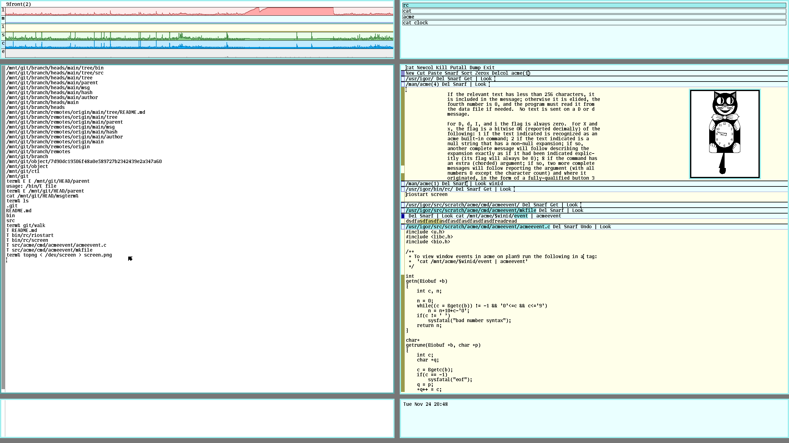

<p align="center">
  
</p>


# 9lab - Random Plan9 Stuff

Collection of programs and scripts used on **9front** running on **Qemu**.

# Desktop

When running in my notebook screen `vgasize=1440x900x32` works great. On my external monitor `vesa=2560x1440x32` works great. To accommodate both I always boot using the smaller size and have the following **rc** script called `screen` to adjust the monitor size:

```sh
; screen big
; screen small
; cat $home/bin/rc/screen
#!/bin/rc

fn Help {
  echo `{basename $0}^' (small|big)'
}

switch ($#*) {
  case 0
    Help
  case *
    switch ($1) {
      case small
        @{rfork n; aux/realemu; aux/vga -m vesa -l 1440x900x32}
      case big
        @{rfork n; aux/realemu; aux/vga -m vesa -l 2560x1440x32}
      case *
        Help
    }
}
```

**rio** is configured via the following `riostart` script:

```sh
; cat $home/bin/rc/riostart
#!/bin/rc
# default vgasize=1440x900x32

#-- top left:  stats
window 0,0,720,120 stats -lmisce
#-- top right: winwatch
window 730,0,1440,120 winwatch -e '^(winwatch|stats|faces)'

#-- left: term
window 0,130,720,800
#-- right: acme
window 730,130,1440,800 acme -a -c 1

#-- bottom left: capturing console messages
window 0,810,720,890 cat /dev/kprint
#-- bottom right: face
window 730,810,1440,890 faces

# run a system shell on the serial console
~ $#console 0 || window -scroll console
```

<p align="center">
  
</p>


# ACME

Cut and Past mouse chording is broken for me on **Qemu** using **9front** *emailschaden*. To debug it I have stolen a program from **Plan9 from User Space** called `acmeevent.c` that prints all events an **acme** window receives.

Compile and install it:

```sh
; cd src/acme/cmd/acmeevent
; mk
; echo $objtype
amd64
; cp acmeevent $home/bin/$objtype
```

Open **acme** and paste the following into the **tag** of the **windows** you want to debug:

```sh
cat /mnt/acme/$winid/event | acmeevent
```

Then you should see all events that are received by the **window** (see **event** in acme(4)).
